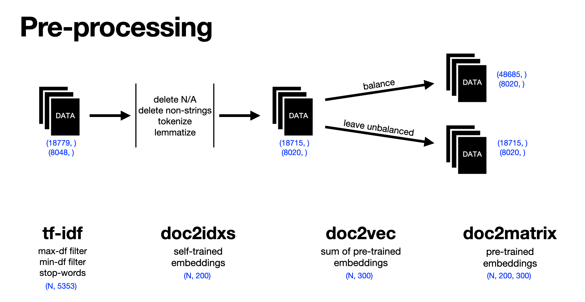

## Maxim Koltiugin

### Classification of emotional coloring into 5 levels

</img>

In this project I've tryed different aprroaches to preprocess text:
- **tf-idf.** Converts each document to a vector of size **5353**. Columns correspond to the tf-idf metric of the most popular words in the dataset, excluding overpopular and stop words.
- **doc2idxs.** This is not an official name of the method. Here I transform each document into a vector of size **200** (max_text_length) which contain indexes of words according to generated vocabulary (containing 36879 words). Futher, they will be used by torch.Embedding() to self-learning embeddings.
- **doc2vec.** Here I'm using Navec's pre-trained embeddings, which are summed up to make up a document embedding.
- **doc2matrix.** Same as mentioned above, but embeddings are not summed. Used for reccurent nets.

## Results

### Classic ML: average f1-scores through 5 classes
|                                       | tf-idf | doc2idxs | doc2vec | doc2matrix |
|---------------------------------------|:------:|:--------:|:-------:|:----------:|
|                  Tree                 |  0.65  |     -    |   0.66  |      -     |
|                  KNN                  |  0.65  |     -    |   0.66  |      -     |
|             Random Forest             |  0.68  |     -    |   0.69  |      -     |
|                XGBoost                |  0.51  |     -    |   0.68  |      -     |
| Ensemble  (tree + knn + rf + XGBoost) |    -   |     -    |   0.69  |      -     |

### Neural nets: average f1-scores through 5 classes
|             | tf-idf | doc2idxs | doc2vec | doc2matrix |
|-------------|:------:|:--------:|:-------:|:----------:|
| FeedForward |  0.65  |     -    |   0.63  |      -     |
|     RNN     |    -   |   0.56   |    -    |    0.56    |
|     GRU     |    -   |   0.63   |    -    |    0.57    |
|     LSTM    |    -   |   0.63   |    -    |    0.53    |

### Best model scores (random forest):
|                | precision | recall   | f1-score    | support |
|:--------------:|:---------:|:--------:|:-----------:|:-------:|
|                |           |          |             |         |
|       -2       |   0.61    |   0.64   |     0.63    |   473   |
|       -1       |   0.74    |   0.72   |     0.73    |   2746  |
|        0       |   0.82    |   0.80   |     0.81    |   4174  |
|        1       |   0.61    |   0.68   |     0.64    |   522   |
|        2       |   0.53    |   0.75   |     0.62    |   105   |
|                |           |          |             |         |
|     accuracy   |           |          |     0.76    |   8020  |
|    macro avg   |   0.66    |   0.72   |     0.69    |   8020  |
| weighted avg   |   0.76    |   0.76   |     0.76    |   8020  |

## Conclusions
- Using **doc2vec** embeddings is consistently more profitable than **tf-idf**
- In case of recurrent networks, it is more efficient to use self-learning embeddings than pre-trained ones

---
**Note**: Content of files **'Data/balanced'** and **'Data/unbalanced'** was removed due to the project size. But it can be restored by running files **Pre-processing_balanced.ipynb** and **Pre-processing_unbalanced.ipynb** respectively.
